  

  

## 👨‍💻 About Me

  

 

I'm a **B.Tech CSE student at NIET (2029)** who builds real products instead of tutorial clones. I run **Alethron Solutions** and ship **EduSaarthi**, a live School ERP, solo, from architecture to deployment.

## 🚀 Featured Projects

<table>
  <tr>
    <td width="50%" valign="top">
      <h3>🏫 EduSaarthi — School Management ERP</h3>
      
Enterprise-grade SaaS for schools, built and shipped solo under Alethron Solutions. Modular monolith with a deliberately lean six-role access model and Postgres row-level security.

      

        
        
        
        
        
        
      

      <a href="https://edusaarthi.app"><b>🔗 Live → edusaarthi.app</b></a>
    </td>
    <td width="50%" valign="top">
      <h3>📈 Dhanwala — Investor Management Platform</h3>
      
Investor management platform built for Nivestra Capital, handling investor data and operations in one place.

      

        <!-- TODO: add the real stack badges -->
        
      

      <a href="https://dhanwala.in"><b>🔗 Live → dhanwala.in</b></a>
    </td>
  </tr>
  <tr>
    <td width="50%" valign="top">
      <h3>🤖 Job Hunt Agent</h3>
      
Autonomous agent that scores resume-to-job fit, ranks postings and drafts tailored cover letters. Submitted to the <i>Agents for Humans</i> hackathon on Devpost.

      

        
        
        
      

      <!-- TODO: add repo / demo link -->
    </td>
    <td width="50%" valign="top">
      <h3>🛡️ Security & Fundamentals</h3>
      
Completed an 8-week <b>Ethical Hacking virtual internship</b> (EduSkills Academy, 2026). Currently grinding DSA and networking fundamentals.

      

        
        
      

    </td>
  </tr>
</table>

## 🛠️ Tech Stack

**Languages** 
  

**Frontend & Backend** 
  

**Databases** 
  

**Cloud & DevOps** 
  

**Creative** 

## 📊 GitHub Analytics

 

## 🎯 Currently

- 🔭 Scaling **EduSaarthi** with real schools
- 🧩 Practising **DSA** daily
- 🔐 Going deeper into **cybersecurity** and **applied AI engineering**
- 🌱 Targeting a **software development internship** this year

## 🤝 Open To

- Internship opportunities
- Open-source contributions
- Beginner-friendly collaborations

 

